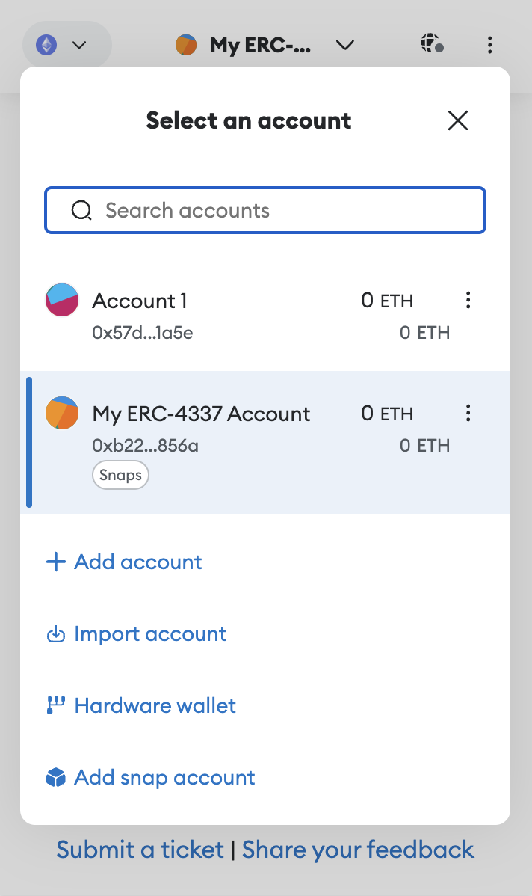
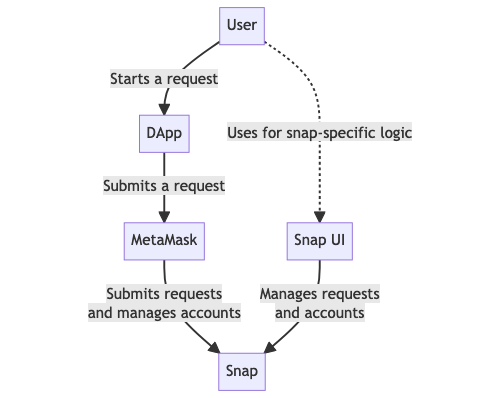
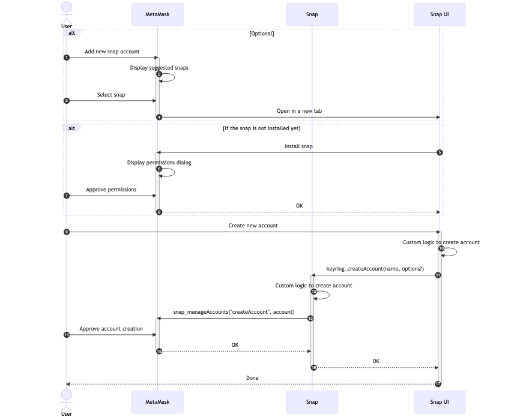
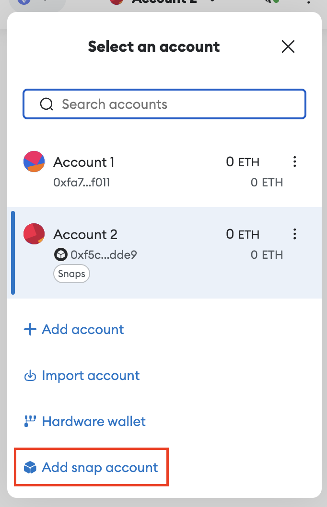
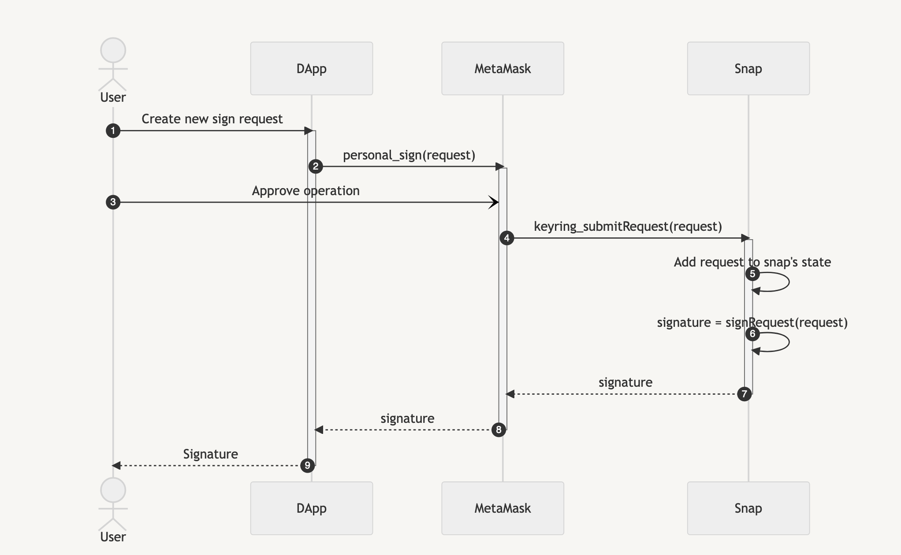
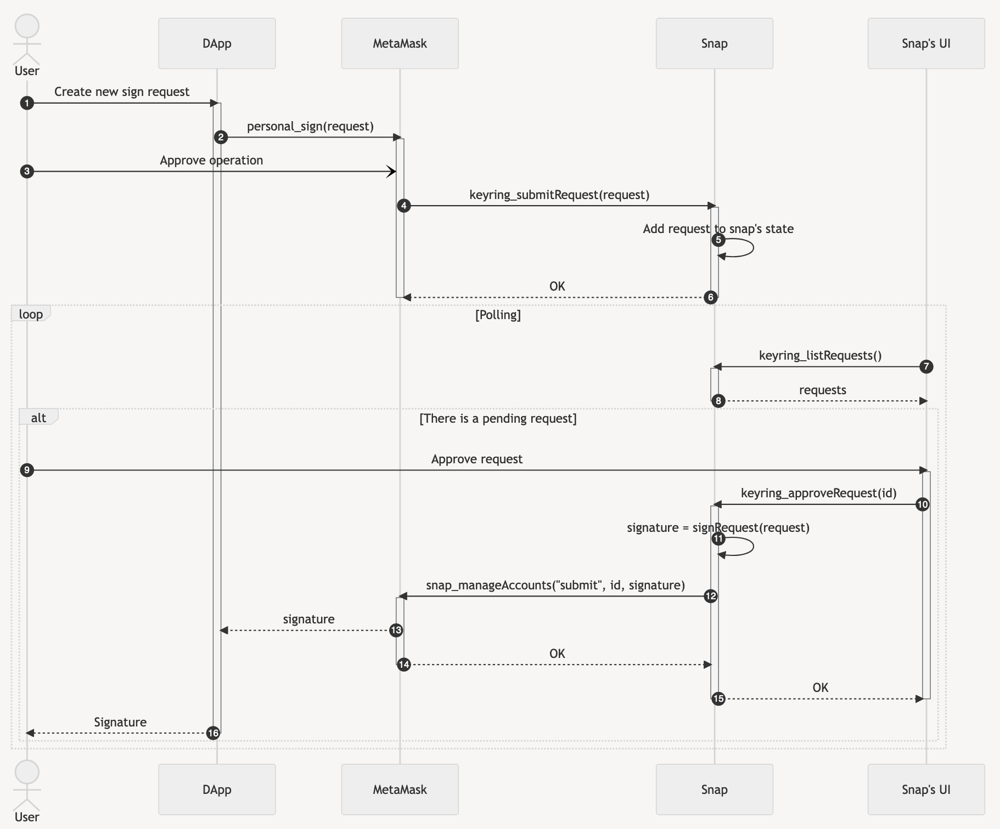

# Integrate custom EVM accounts in MetaMask

Using the [Snaps Keyring API](../concepts/keyring-api.md), you can integrate custom EVM accounts directly in MetaMask. These accounts will be displayed alongside MetaMask-controlled accounts in the UI:



Creating a keyring snap allows Dapps to connect to its accounts and submit requests like `personal_sign`, `eth_sendTransaction`, etc. as if these were regular, MetaMask-controlled accounts.

## Terminology

Let's introduce some terminology used across the Keyring API:

- **Blockchain account**: An object in a single blockchain, representing an account, with its balance, nonce, etc.
- **Request**: A request sent by a Dapp to MetaMask.
- **Keyring account**: An account model that represents one or more blockchain accounts.
- **Keyring snap**: A snap that implements the Keyring API.
- **Keyring request**: A request from MetaMask to a keyring snap, to perform an action on or using a keyring account. It wraps the original request sent by the Dapp and adds some metadata to it.

## Components diagram

When interacting with accounts managed by a Keyring snap, we will encounter the following components:



- **User**: The web3 user interacting with the snap, the Dapp, and MetaMask.
- **Dapp**: The web3 application that is requesting an action to be performed on an account.
- **MetaMask**: The web3 provider that dApps connect to. It routes requests to the keyring snaps and lets the user perform some level of account management.
- **Snap**: A snap that implements the Keyring API to manage the user's accounts, and to handle requests that use these accounts.
- **Snap UI**: The snap's UI component that allows the user to interact with the snap to perform custom operations on accounts and requests.

## Implementing a `Keyring` class

The first step for creating a Keyring snap is to implement the [`Keyring` interface](../reference/keyring-api/modules.md#keyring). This interface describes all the methods necessary to make your custom EVM accounts work inside MetaMask with your own logic. The next sections will go over the methods of the `Keyring` interface by describing the different flows that it handles.

## Snap account creation flow

The first interaction between users and your Keyring snap will be the snap account creation process. Here is a diagram of the process:



The MetaMask account selection modal has an option called "Add snap account":



This option will show a list of keyring snaps, but will ultimately redirect the user to the companion Dapp for your Keyring snap. That is, a Dapp that contains all the UI to configure and manage the Keyring snap.

On that Dapp, you'll present a custom user interface allowing the user configure their custom EVM account. The Dapp will make use of the [`KeyringSnapRpcClient`'s `createAccount` method](../reference/keyring-api/classes/KeyringSnapRpcClient.md#createaccount), which will call your `Keyring` class' method of the same name. An example of this can be found in the [Simple keyring snap companion Dapp](https://github.com/MetaMask/snap-simple-keyring/blob/d3f7f0156c59059c995fea87f90a3d0ad3a4c135/packages/site/src/pages/index.tsx#L136).

In your `Keyring` class' `createAccount` method, your responsibility is to create the account based on the parameters that were passed to you. Your snap has to keep track of the accounts that it creates, which can be done using [`snap_manageState`](../reference/rpc-api.md#snap_managestate). Once your snap has created an account, it should notify MetaMask using the [`snap_manageAccounts` `createAccount` method](../reference/rpc-api.md#createaccount). An example of this process can be found in the [Simple keyring snap code](https://github.com/MetaMask/snap-simple-keyring/blob/d3f7f0156c59059c995fea87f90a3d0ad3a4c135/packages/snap/src/keyring.ts#L61).

Once your snap has created an account, that account can be used to sign messages and transactions. In the following sections we'll look at how this can be done.

## Synchronous signing flow

Your Keyring snap will implement the simple flow if it's able to sign transactions directly. This would be the case if the snap doesn't need a third-party such as a hardware key or a second account's signature, as would be the case for a threshold signature scheme. The flow would look like this:



For a full example of a simple keyring snap, see [`snap-simple-keyring` on GitHub](https://github.com/MetaMask/snap-simple-keyring).


The flow starts when a Dapp calls a method such as `personal_sign` or `eth_signTransaction`, or when the user initiates a new funds transfer from the MetaMask UI. At that point, MetaMask will detect that this interaction is requested for an account controlled by your Keyring snap.

After the user approves the transaction in the UI, MetaMask will call the `submitRequest` method of your `Keyring` class. `submitRequest` will receive the original RPC request, and will need to return a [`SubmitRequestResponse`](../reference/keyring-api/modules.md#submitrequestresponsestruct) with `pending` set to `false`, and `result` set to the requested signature.

:::caution
If your Keyring snap receives an `eth_sendTransaction` request, you must treat it like an `eth_signTransaction` request. That is, your snap is responsible for providing the signature in the response, and MetaMask is responsible for broadcasting the transaction.
:::

## Asynchronous signing flow

If your keyring snap implements a more complex scheme, e.g. threshold signing, then the flow will be more involved, and more `Keyring` methods will be used. The diagram below will help you visualize the flow:



The flow starts the same way: a request to sign a transaction or arbitrary data is initiated by a Dapp or by the user. After approval, your snap's `submitRequest` method is called. 

Since your snap won't answer the request directly, it should store the pending request in its internal state using [`snap_manageState`](../reference/rpc-api.md#snap_managestate). This list of pending requests should be returned when the `listRequests` or `getRequest` methods of your `Keyring` class are called.

After storing the pending request, your snap should direct the user to a "companion Dapp" – a Dapp that serves as UI for the snap – where the rest of the flow can continue. Your snap can do this by creating a pop-up using [`snap_dialog`](../reference/rpc-api.md#snap_dialog) instructing the user to go to the companion Dapp's URL.

The Dapp will list your snap's pending requests using an RPC call facilitated by the [`KeyringSnapRpcClient`'s `listRequests` method](../reference/keyring-api/classes/KeyringSnapRpcClient.md#listrequests). The user can then act on those requests using whatever process applies to the snap.

Once the signing process is completed, the companion Dapp will resolve the request using the [`KeyringSnapRpcClient`'s `approveRequest` method](../reference/keyring-api/classes/KeyringSnapRpcClient.md#approverequest), which will call the snap's `Keyring` method of the same name. This method receives the request's ID, as well as the final result.

When `approveRequest` gets called, it can resolve the pending request by using the [`snap_manageAccounts`' `submitResponse` method](../reference/rpc-api.md#submitresponse).

## Adding the `snap_manageAccounts` permission

Since your snap will make use of the `snap_manageAccounts` function, it needs to request permission for it in the manifest. Edit `snap.manifest.json` as follows:

```json
{
  // ...other settings
  "initialPermissions": {
    // ...other permissions
    "snap_manageAccounts": {}
  }
}
```

## Exposing the `Keyring` class as JSON-RPC endpoints

Once you've written all the business logic for your custom EVM account type, the next step is to expose it as a JSON-RPC API. Exposing a JSON-RPC API in Snaps is done by [exporting an `onRpcRequest` function](../reference/exports.md#onrpcrequest) from the snap package.

The `@metamask/keyring-api` package provides a helper called [`handleKeyringRequest`](../reference/keyring-api/modules.md#handlekeyringrequest). This helper takes an instance of your `Keyring` class and a request object. It responds to requests where the `method` is of type `keyring_*`, and throws a [`MethodNotSupportedError`](../reference/keyring-api/classes/MethodNotSupportedError.md) if it doesn't recognize the request method.

Since your snap will most likely want to answer other JSON-RPC requests than the `keyring_*` ones, another helper called [`buildHandlersChain`](../reference/keyring-api/modules.md#buildhandlerschain) lets you chain multiple RPC handlers together. As each handler in the chain throws a [`MethodNotSupportedError`](../reference/keyring-api/classes/MethodNotSupportedError.md), the next handler in the chain will be called. The return value of `buildHandlersChain` is a function that can be used as the `onRpcRequest` export.

Here's an example of composing two handlers: the keyring handler and a custom handler. This code would go in `packages/snap/src/index.ts`:

```typescript
import {
  MethodNotSupportedError,
  buildHandlersChain,
  handleKeyringRequest,
} from '@metamask/keyring-api';
import type { OnRpcRequestHandler } from '@metamask/snaps-types';

// This is your custom EVM account implementation
import { MyKeyring } from './keyring';

let keyring: MyKeyring;

/**
 * Handle keyring requests.
 *
 * @param args - Request arguments.
 * @param args.request - Request to execute.
 * @returns The execution result.
 */
const keyringHandler: OnRpcRequestHandler = async ({ request }) => {
  if (!keyring) {
    const state = await snap.request({
      method: 'snap_manageState',
      params: { operation: 'get' },
    });
    if (!keyring) {
      keyring = new MyKeyring(state);
    }
  }
  return await handleKeyringRequest(keyring, request);
};

/**
 * Execute a custom snap request.
 *
 * @param args - Request arguments.
 * @param args.request - Request to execute.
 * @returns The execution result.
 */
const customHandler: OnRpcRequestHandler = async ({
  request,
}): Promise<any> => {
  switch (request.method) {
    // internal methods
    case 'mysnap_hello': {
      return 'Hello World!';
    }

    default: {
      throw new MethodNotSupportedError(request.method);
    }
  }
};

/**
 * Compose both handlers
 */
export const onRpcRequest: OnRpcRequestHandler = buildHandlersChain(
  keyringHandler,
  customHandler,
);
```

## Using the keyring API from a Dapp

As you're building a companion Dapp to provide a user interface for your Keyring snap, you'll need to interact with your snap's JSON-RPC API. While you could do this by making regular RPC calls using [`wallet_invokeSnap`](../reference/rpc-api.md#wallet_invokesnap), we provide a more elegant solution.

From your Dapp, you can use the [`KeyringSnapRpcClient`](../reference/keyring-api/classes/KeyringSnapRpcClient.md) from the `@metamask/keyring-api` package, like so:

```typescript
import { KeyringSnapRpcClient } from '@metamask/keyring-api';
import { defaultSnapOrigin as snapId } from '../config';

const keyringClient = new KeyringSnapRpcClient(snapId, window.ethereum);

// Example usage, after the user fills the steps to create an account...
keyringClient.createAccount(name, options);

// The above call is equivalent to
window.ethereum.request({
  method: 'wallet_invokeSnap',
  params: {
      snapId,
      request: {
        method: 'keyring_createAccount',
        params: { name, options }
      }
  },
});
```
